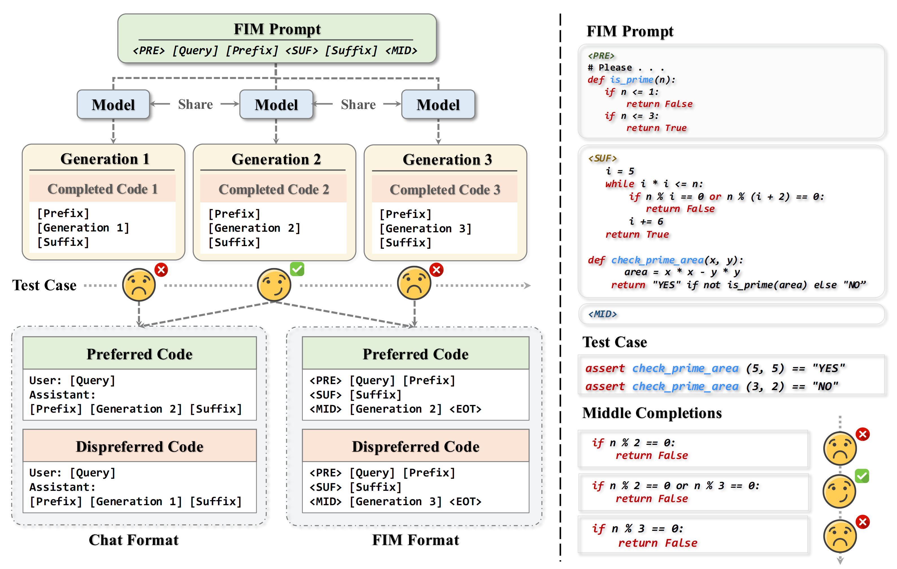

## Alignment with Fill-In-the-Middle for Enhancing Code Generation

<p align="center">
    <a href="https://arxiv.org/abs/2508.19532">📄 Paper</a> •
    <a href="https://github.com/SenseLLM/StructureCoder">🏠 Repo</a> •
    <a href="https://huggingface.co/SenseLLM/StructureCoder-7B">🤖 Models</a>
</p>

## Introduction
Structure splits code snippets into smaller, granular blocks, creatingmore diverse DPO pairs from the same testcases. Additionally, we introduce the Abstract Syntax Tree (AST) splitting and curriculum training method to enhance the DPO training. Please refer to our paper for more details!



<hr>

## Models

| Model               | Checkpoint                                                        | Size |
|:--------------------|:------------------------------------------------------------------|:-----|
| StructureCoder-1.5B | 🤗 [HF Link](https://huggingface.co/SenseLLM/StructureCoder-1.5B) | 1.5B |
| StructureCoder-3B   | 🤗 [HF Link](https://huggingface.co/SenseLLM/StructureCoder-3B)   | 3B   |
| StructureCoder-7B   | 🤗 [HF Link](https://huggingface.co/SenseLLM/StructureCoder-7B)   | 7B   |

## Train and Evaluation

### Download Data

```bash
cd data
python download.py
```

### Train process

#### Black Format

```bash
cd data
python process.py -t format_code -i input_file -o output_file
```

#### Check Label

```bash
cd data
# input file: file after black format
python check.py -i input_file -o output_file
```

#### Extract Block

```bash
cd data
# input file: file after check label
python process.py -t fim -i input_file -o output_file
python process.py -t full -i input_file -o output_file
```

#### Generation

```bash
python construct.py -t fim -p model_path -i input_file -o output_file
python construct.py -t full -p model_path -i input_file -o output_file

#### Check Generation Result
python check.py -i input_file -o output_file

#### Process Check Result; Output training data
python process -i input_dir -o output_file --epoch 3 -t fim fulls
```

#### Train

You can directly use the open-sourced training data to train the model.

```bash
torchrun --nproc_per_node 8 train_dpo.py \
  --seed 3407 \
  --report_to tensorboard \
  --dataloader_num_workers 8 \
  --remove_unused_columns False \
  --save_steps 100 \
  --max_len 2048 \
  --warmup_ratio 0.05 \
  --logging_steps 10 \
  --num_train_epochs 1 \
  --lr_scheduler_type cosine_with_min_lr \
  --lr_scheduler_kwargs '{"min_lr_rate": 0.1}' \
  --optim rmsprop \
  --per_device_train_batch_size 1 \
  --gradient_accumulation_steps 16 \
  --bf16 \
  --do_train \
  --save_only_model \
  --save_safetensors \
  --gradient_checkpointing \
  --deepspeed config/stage_1.json \
  --learning_rate 1e-6 \
  --model_cfg model_path \
  --train_file train_file \
  --output_dir output_dir
```

#### Test

```bash
python test -p output_dir/checkpoint-final
```

## Acknowledgments

We thank the following amazing projects that truly inspired us:

- [Qwen-Coder](https://github.com/QwenLM/Qwen3-Coder)
- [APPS](https://github.com/hendrycks/apps)
- [EvalPlus](https://github.com/evalplus/evalplus)
- [LiveCodeBench](https://github.com/LiveCodeBench/LiveCodeBench)
- [BigCodeBench](https://github.com/bigcode-project/bigcodebench)